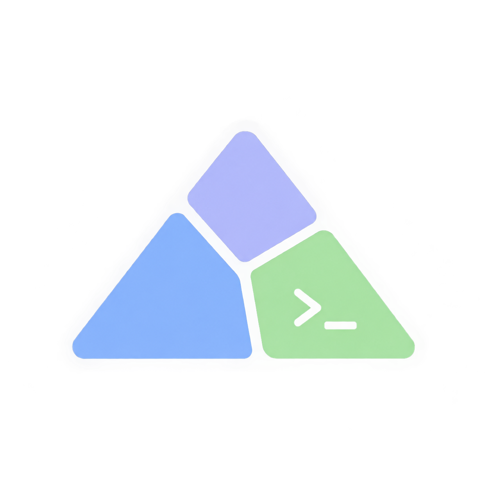

<p align="center">
  
</p>

<h1 align="center">Arch Linux Config</h1>

<p align="center">An interactive installer for Catppuccin-inspired i3 and Sway desktops.</p>

<p align="center">
  <a href="LICENSE"></a>
  
  
  
  
</p>

[Get started](#get-started) · [Sway / Wayland](#sway--wayland-desktop) · [Package catalogue](#package-catalogue) · [Neovim / Laravel](#neovim--laravel) · [Backups](#configuration-and-backups)

## What it sets up

- Compact i3 gaps (6px between windows, 4px outer), 1px dark borders, a top status bar, and Picom rounded corners.
- Optional Sway/Wayland session with matching colors and gaps, a top Waybar, native touch input, and English/Arabic layouts; i3 stays available.
- Compact Wi-Fi, CPU, RAM, disk, battery, and clock readouts with warning colors.
- 12-hour clock (`Sat 19 Sep  |  09:49 PM`); hover it for a month calendar, scroll to change month, right-click for a year view, middle-click to return to today.
- Rofi with Catppuccin, Nord, and Dracula themes.
- Flameshot screenshots, Arabic-capable Noto fonts, and GTK dark preferences.
- Bluetooth and network tray applets, PipeWire audio, and two-finger scrolling.
- Optional browsers, file utilities, development tools, and AUR applications.
- Optional Conky system panel with Catppuccin, Nord and Dracula themes, switched with Alt+Shift+T.
- Optional colorls, so `ls` lists files with colours and icons (`colorls -l`) in Bash and Zsh.
- Interactive package choices, preview mode, and configuration backups.
- On the ASUS Zenbook S 16 (UM5606) only, an optional fix for the firmware CPU power cap.

## Package catalogue

Every package named by the installer scripts or the captured explicit-package
inventory is listed below, followed by separately installed tools and Neovim
plugins. This is a catalogue, **not a claim that every item is installed**:
all installer prompts default to No. Transitive dependencies are resolved by the
package managers and are not exhaustively listed. Emoji are category icons,
not official project logos.

Sources: [main installer](install.sh), [Zsh setup](setup-zsh.sh),
[Neovim setup](setup-nvim.sh), [captured inventory](installed-explicit.txt),
[Sway setup](setup-sway.sh), [Sway package manifest](sway/packages.txt),
[Zenbook UM5606 CPU power-cap fix](setup-zenbook-cpu-cap.sh),
[Conky panel setup](setup-conky.sh),
[colorls setup](setup-colorls.sh),
[Herdr setup](setup-herdr.sh),
[private SSH setup](setup-ssh.sh),
[Mason configuration](config/nvim/lua/anbar/plugins/mason.lua), and
[locked Neovim plugins](config/nvim/lazy-lock.json). System-package descriptions
are based on local Arch package metadata and each package's role in this setup.

### System applications and packages

“Installer” means offered by a selected package group; “Neovim” and “Zsh” refer
to those optional setup sections. “Inventory only” requires individual selection
and does not configure boot, disk or other system settings. Legacy/AUR entries
come from older notes and may be unavailable; they are not prerequisites.

| Icon | Package | Installation choice | Summary |
| --- | --- | --- | --- |
| ⌨️ | `alacritty` | Legacy option | A cross-platform, GPU-accelerated terminal emulator. |
| 🔊 | `alsa-utils` | Installer | Advanced Linux Sound Architecture - Utilities. |
| ⚙️ | `amd-ucode` | Inventory only | Microcode update image for AMD CPUs. |
| ⚙️ | `base` | Inventory only | Minimal package set to define a basic Arch Linux installation. |
| 🧰 | `base-devel` | Installer | Build-tool metapackage for compiling software and AUR packages. |
| 📡 | `blueman` | Installer | GTK+ Bluetooth Manager. |
| 📡 | `bluez` | Installer | Daemons for the bluetooth protocol stack. |
| 📡 | `bluez-utils` | Installer | Development and debugging utilities for the bluetooth protocol stack. |
| 🔎 | `bpytop` | Legacy option | Terminal CPU, memory, disk and network monitor. |
| ☀️ | `brightnessctl` | Laptop shortcuts | Adjust the hardware display backlight without keyboard-LED changes. |
| 💾 | `btrfs-progs` | Installer | Btrfs filesystem utilities. |
| 🧰 | `composer` | Installer | Dependency Manager for PHP. |
| 📊 | `conky` | Conky panel | Light-weight system monitor for X, Wayland, and other things, too. |
| 🖨️ | `cups` | Installer | OpenPrinting CUPS - daemon package. |
| 🌐 | `curl` | Installer / Neovim | Transfer data and download official installers, including Herdr and Rustup. |
| 🖥️ | `dex` | Installer | Program to generate and execute DesktopEntry files of type Application. |
| 💬 | `dialog` | Installer | A tool to display dialog boxes from shell scripts. |
| 💬 | `discord` | Optional applications | Voice, video and text chat. |
| 🐳 | `docker` | Docker setup | Container engine, command-line client and system daemon. |
| 🐳 | `docker-compose` | Docker setup | Define and run multi-container applications using `docker compose`. |
| 🖥️ | `dmenu` | Legacy option | Generic menu for X. |
| 💾 | `dosfstools` | Installer | DOS filesystem utilities. |
| 📦 | `dropbox` | Optional AUR | Synchronize files with Dropbox. |
| ⚙️ | `efibootmgr` | Inventory only | Linux user-space application to modify the EFI Boot Manager. |
| 📁 | `fd` | Neovim | Simple, fast and user-friendly alternative to find. |
| 📁 | `file-roller` | Installer | Create and modify archives. |
| 🌐 | `firefox` | Installer | Web browser. |
| 📷 | `flameshot` | Installer | Capture and annotate screenshots. |
| 🧰 | `git` | Installer | Track source-code changes and work with Git repositories. |
| 🧰 | `github-cli` | Installer | The GitHub CLI. |
| 🧰 | `go` | Neovim | Core compiler tools for the Go programming language. |
| 🌐 | `google-chrome` | Optional AUR / Chrome prompt | Google's web browser, installed using `yay -S --needed google-chrome`. |
| 📷 | `gpicview` | Installer | Lightweight image viewer. |
| ⚙️ | `grub` | Inventory only | GNU GRand Unified Bootloader (2). |
| 💾 | `grub-btrfs` | Installer | Integrate Btrfs snapshots into GRUB menus; configuration remains manual. |
| ⚙️ | `gsettings-desktop-schemas` | Installer | Desktop preference schemas used for dark-mode settings. |
| 📁 | `gvfs` | Installer | Virtual filesystem implementation for GIO. |
| 🌐 | `inetutils` | Installer | Common network programs; provides `hostname`, which Arch does not install by default. |
| 🖥️ | `i3-wm` | Installer | Tiling window manager with the bundled gaps and keybindings. |
| 🔒 | `i3lock` | Installer | Improved screenlocker based upon XCB and PAM. |
| 🖥️ | `i3status` | Installer | Generates status bar to use with i3bar, dzen2 or xmobar. |
| ⌨️ | `kitty` | Installer | GPU-accelerated terminal emulator, configured with Catppuccin Mocha. |
| 🐳 | `lazydocker` | Docker setup | Terminal UI for Docker containers, images, logs and Compose services. |
| 🧰 | `lazygit` | Neovim | Simple terminal UI for git commands. |
| 🔎 | `less` | AUR build review | A terminal based program for viewing text files. |
| 🔊 | `libpulse` | Installer | PulseAudio-compatible client library and command-line audio tools. |
| 🔒 | `lightdm` | Installer | A lightweight display manager. |
| 🔒 | `lightdm-gtk-greeter` | Installer | GTK+ greeter for LightDM. |
| 🔒 | `lightdm-gtk-greeter-settings` | Installer | Settings editor for the LightDM GTK+ Greeter. |
| ⚙️ | `linux` | Inventory only | The Linux kernel and modules. |
| ⚙️ | `linux-firmware` | Inventory only | Firmware files for Linux - Default set. |
| ⚙️ | `linux-headers` | Inventory only | Headers and scripts for building modules for the Linux kernel. |
| 🔐 | `mkcert` | Installer | Simple tool for making locally-trusted development certificates. |
| 💾 | `mtools` | Installer | A collection of utilities to access MS-DOS disks. |
| 📝 | `neovim` | Installer | Extensible editor used by the bundled development configuration. |
| 📡 | `network-manager-applet` | Installer | Applet for managing network connections. |
| 📡 | `networkmanager` | Installer | Network connection manager and user applications. |
| 🖥️ | `nitrogen` | Legacy option | Choose and restore an X11 wallpaper. |
| 🧰 | `nodejs` | Neovim | JavaScript runtime for development tools and language servers. |
| 🔤 | `noto-fonts` | Installer | Unicode fonts, including Arabic text support. |
| 🔐 | `nss` | Installer | Network Security Services; `certutil` lets mkcert trust its CA in Firefox and Chrome. |
| 😀 | `noto-fonts-emoji` | Laptop shortcuts | Color emoji font used by the picker and applications. |
| 🧰 | `npm` | Neovim | JavaScript package manager. |
| 💾 | `ntfs-3g` | Installer | NTFS FUSE driver. |
| 📝 | `obsidian` | Optional applications | Markdown-based notes and knowledge management. |
| 🔐 | `openssh` | Installer | SSH client and key utilities for secure remote connections. The server service is not enabled. |
| 🔊 | `pasystray` | Inventory only | Volume tray applet retained in the old inventory; not autostarted. |
| 🧰 | `php` | Installer | PHP runtime for Laravel, Composer and language tools. |
| 🖥️ | `picom` | Installer | X11 compositor for shadows, transparency and rounded corners. |
| 🔊 | `pipewire` | Installer | Audio/video processing service. |
| 🔊 | `pipewire-alsa` | Installer | Low-latency audio/video router and processor - ALSA configuration. |
| 🔊 | `pipewire-jack` | Installer | Low-latency audio/video router and processor - JACK replacement. |
| 🔊 | `pipewire-pulse` | Installer | Low-latency audio/video router and processor - PulseAudio replacement. |
| 🧰 | `postman` | Optional AUR | Build and test API requests. |
| ⚙️ | `psmisc` | Installer | Process utilities including killall, fuser and pstree. |
| 📝 | `retext` | Installer | Markdown editor; its preview mode is the default viewer for `.md` files. |
| 🔎 | `ripgrep` | Neovim | A search tool that combines the usability of ag with the raw speed of grep. |
| 🖥️ | `rofi` | Installer | Themed application launcher and window switcher. |
| 😀 | `rofi-emoji` | Laptop shortcuts | Search emoji and copy a selection to the clipboard. |
| 💎 | `ruby` | colorls setup | An object-oriented language for quick and easy programming; runs colorls. |
| 🎨 | `ruby-colorls` | Optional AUR / colorls setup | Beautifies `ls` with colours and file icons; installed using `yay -S --needed ruby-colorls`. |
| 📷 | `scrot` | Legacy option | Simple command-line screenshot utility for X. |
| 💬 | `teams` | Optional AUR | Legacy Microsoft Teams client entry from the old notes. |
| 📁 | `thunar` | Installer | Modern, fast and easy-to-use file manager for Xfce. |
| 📁 | `thunar-archive-plugin` | Installer | Adds archive operations to the Thunar file context menus. |
| 💾 | `timeshift` | Installer | A system restore utility for Linux. |
| 💾 | `timeshift-autosnap` | Optional AUR | Create Timeshift snapshots around package upgrades. |
| 🌐 | `tor-browser` | Optional AUR | Web browser configured for the Tor network. |
| 🖥️ | `trayer` | Legacy option | Standalone X11 system tray. |
| 🔤 | `ttf-jetbrains-mono-nerd` | Neovim / Conky panel / kitty | Patched font JetBrains Mono from nerd fonts library. |
| 📁 | `unzip` | Neovim | For extracting and viewing files in .zip archives. |
| 🐍 | `uv` | Installer | Python package, project and tool manager; includes `uvx` for running Python tools. |
| 📝 | `vim` | Installer | Vi Improved, a highly configurable, improved version of the vi text editor. |
| 🔊 | `wireplumber` | Installer | Session / policy manager implementation for PipeWire. |
| 📁 | `xarchiver` | Legacy option | GTK frontend to various command line archivers. |
| 📋 | `xclip` | Neovim | Command line interface to the X11 clipboard. |
| 📁 | `xdg-user-dirs` | Installer | Manage user directories like ~/Desktop and ~/Music. |
| 📁 | `xdg-utils` | Installer | Command line tools that assist applications with a variety of desktop integration tasks. |
| ⌨️ | `xf86-input-libinput` | Installer | Generic input driver for the X.Org server based on libinput. |
| 🖥️ | `xmobar` | Legacy option | Minimalistic Text Based Status Bar. |
| 🖥️ | `xmonad` | Legacy option | Lightweight X11 tiled window manager written in Haskell. |
| 🖥️ | `xmonad-contrib` | Legacy option | Community-maintained extensions for xmonad. |
| 🖥️ | `xmonad-utils` | Legacy option | Small collection of X utilities. |
| 🖥️ | `xorg-server` | Installer | Xorg X server. |
| ⌨️ | `xorg-setxkbmap` | Installer | Configure English/Arabic X11 layouts and the Shift+Caps Lock language switch. |
| 🖥️ | `xorg-xinit` | Installer | X.Org initialisation program. |
| ⌨️ | `xorg-xinput` | Installer | Small commandline tool to configure devices. |
| 🖥️ | `xorg-xrandr` | Installer | Primitive command line interface to RandR extension. |
| 🔒 | `xss-lock` | Installer | Use external locker as X screen saver. |
| 📦 | `yay-bin` | Optional AUR helper | Prebuilt yay helper for Arch repositories and AUR packages. |
| 📦 | `yay-bin-debug` | Inventory only | Debug symbols for the prebuilt yay package. |
| ⚙️ | `zramd` | Optional AUR | Configure compressed RAM-backed swap. |
| ⌨️ | `zsh` | Zsh | A very advanced and programmable command interpreter (shell) for UNIX. |
| ⌨️ | `zsh-autosuggestions` | Zsh | Fish-like autosuggestions for zsh. |
| ⌨️ | `zsh-syntax-highlighting` | Zsh | Fish shell like syntax highlighting for Zsh. |

### Additional Sway packages

The optional [Sway setup](setup-sway.sh) installs the complete
[package manifest](sway/packages.txt), including these additional packages.
It also reuses the existing catalogue's Firefox, Kitty, Rofi/emoji, Noto fonts,
brightnessctl, Bluetooth/network applets, PipeWire/WirePlumber, libpulse,
gsettings-desktop-schemas and XDG utilities. No i3 package is required by this
standalone setup. It never removes an existing desktop.

| Icon | Package | Summary |
| --- | --- | --- |
| 🔌 | `dbus` | Session messaging and desktop activation-environment utilities. |
| 📷 | `grim` | Capture screenshots directly from the Wayland compositor. |
| 🧰 | `jq` | Inspect JSON from Sway and validate the Waybar configuration. |
| 💬 | `libnotify` | Send desktop notifications from screenshot helpers. |
| 💬 | `mako` | Lightweight Wayland notification daemon with Catppuccin colors. |
| 🔐 | `polkit-gnome` | Graphical authentication prompts for privileged desktop actions. |
| 🖥️ | `qt5-wayland` | Native Wayland integration for Qt 5 applications. |
| 🖥️ | `qt6-wayland` | Native Wayland integration for Qt 6 applications. |
| 📐 | `slurp` | Select a screen region for screenshots and sharing. |
| 🖥️ | `sway` | Wayland tiling compositor with familiar i3-style controls. |
| 🎨 | `swaybg` | Draw the Sway desktop background. |
| 💤 | `swayidle` | Lock on inactivity or before sleep and power down idle screens. |
| 🔒 | `swaylock` | Lock the Wayland session using your normal login password. |
| 📊 | `waybar` | Top status bar with workspaces, keyboard language, system stats and tray. |
| 📋 | `wl-clipboard` | Native Wayland clipboard for screenshots and emoji. |
| 🗂️ | `xdg-desktop-portal-gtk` | File choosers and general desktop portal integration. |
| 📹 | `xdg-desktop-portal-wlr` | Screen-sharing and screenshot portals for wlroots compositors. |
| 🪟 | `xorg-xwayland` | Compatibility layer for applications that still require X11. |

### Standalone tools, shell and language runtimes

These are downloaded only when their corresponding setup step is accepted.
Rust is installed through Rustup, not the Arch `rust` package.

| Icon | Tool | Installed through | Summary |
| --- | --- | --- | --- |
| 🐚 | Oh My Zsh | Git / Zsh setup | Shell framework and bundled Git, sudo, extract and colored-man-pages plugins. |
| 🐑 | [Herdr](https://herdr.dev/) | Optional official installer | Persistent terminal workspaces for running and managing coding-agent sessions. |
| 🦀 | Rustup | Official interactive installer | Install and manage Rust toolchains. |
| 🦀 | Rust / `rustc` | Rustup stable toolchain | Rust compiler needed for source-built tools. |
| 📦 | Cargo | Rustup stable toolchain | Rust package/build tool required by htmx-lsp. |
| 🧩 | `laravel/lsp` | Composer global | Official Laravel language server for PHP and Blade editing. |

### Mason language servers and formatters

Installed by the optional Mason step. These are Mason registry names, not
pacman packages. Installing a tool does not necessarily enable it for every
filetype; its use depends on the corresponding editor/project configuration.

| Icon | Package | Summary |
| --- | --- | --- |
| 🐘 | `phpactor` | PHP language server with navigation and refactoring support. |
| 🌙 | `lua-language-server` | Lua completion, diagnostics and navigation. |
| 🗂️ | `json-lsp` | JSON language support and schema validation. |
| 💚 | `vue-language-server` | Vue component language support. |
| 📜 | `typescript-language-server` | JavaScript and TypeScript language support. |
| 🦀 | `rust-analyzer` | Rust completion, diagnostics and navigation. |
| ⚡ | `emmet-language-server` | Emmet abbreviation completion for markup and styles. |
| 🧡 | `svelte-language-server` | Svelte component language support. |
| 🌐 | `html-lsp` | HTML completion and validation. |
| ✨ | `stylua` | Lua code formatter. |
| ✨ | `prettier` | Formatter for JavaScript, TypeScript, markup and other web files. |
| 🔎 | `eslint_d` | Background ESLint runner; requires project lint configuration. |
| 🎨 | `tailwindcss-language-server` | Tailwind CSS class completion and language support. |
| 🐘 | `pint` | Laravel's PHP code-style formatter. |
| 🗡️ | `blade-formatter` | Laravel Blade template formatter. |
| 🐳 | `hadolint` | Dockerfile linter. |
| 🗃️ | `sql-formatter` | SQL query formatter. |
| 🐹 | `gopls` | Go language server. |
| ✨ | `gofumpt` | Strict Go source formatter. |
| 📦 | `goimports-reviser` | Organize and group Go imports. |
| 📏 | `golines` | Shorten long Go lines through formatting. |
| 🌐 | `htmx-lsp` | HTMX language support; built with Rust/Cargo. |

### Neovim plugins

These are Git plugins managed by lazy.nvim, not system packages. The table
covers every entry in the bundled lockfile, including helper libraries.
Some load only on demand; having a completion source installed does not mean
it is enabled in every buffer. Codeium and Copilot are excluded.

<details>
<summary>Expand the complete Neovim plugin table (91 plugins)</summary>

| Icon | Plugin | Summary |
| --- | --- | --- |
| 🎨 | `Comment.nvim` | Toggle line and block comments. |
| 💡 | `LuaSnip` | Snippet expansion engine. |
| 🎨 | `automkdir.nvim` | Create missing parent directories when saving files. |
| 🎨 | `bufferline.nvim` | Buffer tabs and navigation. |
| 💡 | `cmp-buffer` | Completion from buffer text. |
| 💡 | `cmp-cmdline` | Command-line completion source. |
| 💡 | `cmp-dotenv` | Completion source for environment variables. |
| 💡 | `cmp-npm` | NPM package-name completion. |
| 💡 | `cmp-nvim-lsp` | Connect LSP completion to nvim-cmp. |
| 💡 | `cmp-path` | Filesystem path completion. |
| 💡 | `cmp-spell` | Spell-check completion source. |
| 💡 | `cmp-tw2css` | Translate Tailwind utilities in completion. |
| 💡 | `cmp-under-comparator` | Completion sorting helper for underscore-prefixed names. |
| 💡 | `cmp_luasnip` | Connect LuaSnip to nvim-cmp. |
| 🎨 | `color-picker.nvim` | Interactive color selection. |
| 🎨 | `comment-box.nvim` | Decorative comment boxes and separators. |
| 🎨 | `conform.nvim` | Formatting and format-on-save management. |
| 🧰 | `crates.nvim` | Cargo dependency versions and editing helpers. |
| 🎨 | `dressing.nvim` | Enhanced input and selection dialogs. |
| 🧩 | `ejs-syntax` | EJS template syntax support. |
| 🧩 | `emmet-vim` | Expand Emmet markup abbreviations. |
| 🎨 | `fidget.nvim` | Language-server progress display. |
| 💡 | `friendly-snippets` | Ready-made snippets for many languages. |
| 🌿 | `gitsigns.nvim` | Git changes, hunk actions and inline blame. |
| 🧰 | `go.nvim` | Go editing and development helpers. |
| 🧩 | `guihua.lua` | UI components used by Go tooling. |
| 🎨 | `indent-blankline.nvim` | Indentation guides. |
| 🧰 | `laravel.nvim` | Laravel Artisan, routes, Tinker and project helpers. |
| 🎨 | `lazy.nvim` | Neovim plugin installation and loading. |
| 🎨 | `lazydocker.nvim` | Open an external lazydocker terminal interface. |
| 🌿 | `lazygit.nvim` | Open the LazyGit terminal interface. |
| 🧰 | `lspkind.nvim` | Icons for completion item kinds. |
| 🎨 | `lualine.nvim` | Configurable editor status line. |
| 🎨 | `markdown-preview.nvim` | Preview Markdown in a browser. |
| 🧰 | `mason-tool-installer.nvim` | Install the configured Mason tool list. |
| 🧰 | `mason.nvim` | Manage language servers, linters and formatters. |
| 🔎 | `neo-tree.nvim` | Sidebar file explorer. |
| 🎨 | `noice.nvim` | Enhanced command line, messages and notifications. |
| 🎨 | `none-ls.nvim` | Bridge external tools into LSP; bundled sources are empty. |
| 🎨 | `nui.nvim` | Reusable Neovim UI components. |
| 🎨 | `nvim` | Catppuccin color theme; lockfile name for catppuccin/nvim. |
| 🧩 | `nvim-autopairs` | Automatically insert matching brackets and quotes. |
| 💡 | `nvim-cmp` | Completion menu engine. |
| 🎨 | `nvim-colorizer.lua` | Preview color values inline. |
| 🐞 | `nvim-dap` | Debug Adapter Protocol client. |
| 🐞 | `nvim-dap-go` | Go debugger integration; requires a suitable debugger. |
| 🧩 | `nvim-devdocs` | Browse programming documentation. |
| 🧰 | `nvim-lspconfig` | Language-server configuration definitions. |
| 🧩 | `nvim-neoclip.lua` | Clipboard history with Telescope integration. |
| 🧩 | `nvim-nio` | Asynchronous I/O library for plugins. |
| 🎨 | `nvim-notify` | Popup notifications. |
| 🧩 | `nvim-spectre` | Project-wide search and replace. |
| 🧩 | `nvim-surround` | Add, change and remove surrounding delimiters. |
| 🧩 | `nvim-tmux-navigation` | Navigate between Neovim windows and tmux panes. |
| 🔎 | `nvim-treesitter` | Install syntax parsers and enable structural highlighting. |
| 🔎 | `nvim-treesitter-textobjects` | Syntax-aware selection and movement. |
| 🧩 | `nvim-ts-autotag` | Automatically close and rename markup tags. |
| 🧩 | `nvim-ts-context-commentstring` | Choose comment syntax for embedded languages. |
| 🧩 | `nvim-ufo` | Code-folding enhancements. |
| 🧩 | `nvim-web-devicons` | File-type icons. |
| 🎨 | `obsidian.nvim` | Navigate and edit Obsidian Markdown vaults. |
| 🔎 | `oil.nvim` | Edit directories as buffers. |
| 🎨 | `plenary.nvim` | Shared Lua utilities used by plugins. |
| 🎨 | `prettierrc.nvim` | Use Prettier configuration for editor formatting preferences. |
| 🧩 | `promise-async` | Promise-based asynchronous helpers. |
| 🎨 | `splitjoin.nvim` | Split and join code structures. |
| 🎨 | `symbols-outline.nvim` | Tree view of document symbols. |
| 💡 | `tailwindcss-colorizer-cmp.nvim` | Color previews for Tailwind completion entries. |
| 🔎 | `telescope-file-browser.nvim` | File-browser picker. |
| 🔎 | `telescope-fzf-native.nvim` | Compiled fuzzy matching for Telescope. |
| 🔎 | `telescope-live-grep-args.nvim` | Pass additional arguments to live text searches. |
| 🔎 | `telescope-media-files.nvim` | Media-file search and previews; external preview tools may be needed. |
| 🔎 | `telescope-project.nvim` | Project selection picker. |
| 🔎 | `telescope-symbols.nvim` | Symbol and emoji picker data. |
| 🔎 | `telescope-ui-select.nvim` | Use Telescope for selection dialogs. |
| 🔎 | `telescope.nvim` | Searchable pickers for files, text, keymaps and more. |
| 🎨 | `todo-comments.nvim` | Highlight and find TODO-style comments. |
| 🎨 | `toggleterm.nvim` | Manage embedded terminal windows. |
| 🎨 | `trouble.nvim` | Diagnostics and quickfix-style lists. |
| 🧰 | `tsc.nvim` | Run TypeScript checking and show results. |
| 🧰 | `vim-blade` | Laravel Blade syntax and filetype support. |
| 🧩 | `vim-dadbod` | Database query interface. |
| 🧩 | `vim-dadbod-completion` | SQL completion for database workflows. |
| 🧩 | `vim-dadbod-ui` | Database connection and query sidebar. |
| 🧩 | `vim-dotenv` | Load project environment variables. |
| 🌿 | `vim-fugitive` | Git commands inside Neovim. |
| 🧰 | `vim-prisma` | Prisma schema syntax support. |
| 🧩 | `vim-visual-multi` | Multiple-cursor editing. |
| 🧰 | `vim-vue` | Vue file syntax support. |
| 🎨 | `which-key.nvim` | Discover available keybindings in popup menus. |
| 🎨 | `wrapping.nvim` | Manage hard and soft text wrapping. |

</details>

Tree-sitter parsers are grammar assets, not additional pacman packages. The
configuration requests: Lua, Vim, Vimdoc, JavaScript, HTML, CSS, SCSS, JSON,
JSONC, regex, Prisma, Svelte, PHP, Blade, TypeScript, TSX, Go, Rust, Markdown
and Markdown inline.

## Get started

```bash
git clone https://github.com/AhmedAnbar/arch-linux-config.git
cd arch-linux-config
```

Run on an already-installed Arch system as your normal user with sudo access:

```bash
bash install.sh --dry-run
bash install.sh
```

## Local HTTPS certificates (mkcert)

The development package group includes `mkcert` and `nss`. The installer then
offers `mkcert -install`, which creates a local certificate authority in
`~/.local/share/mkcert` and trusts it system-wide and in the Firefox and Chrome
certificate stores (it asks for sudo for the system store). Run it as your
normal user, not with `sudo`, or the CA is created for root instead.

```bash
mkcert -install                                  # once per machine
mkcert myapp.test localhost 127.0.0.1 ::1        # writes myapp.test+3.pem and -key.pem
```

On Arch, `mkcert -install` also prints `ERROR: no Firefox and/or Chrome/Chromium
security databases found`. This is expected and harmless: mkcert 1.4.4 only looks
in `~/.mozilla/firefox` and `~/.pki/nssdb`, while current Firefox and Chrome keep
their databases under `~/.config/mozilla` and `~/.local/share/pki`. Arch's `nss`
links its built-in roots (`libnssckbi.so`) to p11-kit, so both browsers trust the
system store, where the CA was added. Confirmed with Firefox 155 and Chrome 153.

Restart open browsers after installing the CA. `rootCA-key.pem` must stay
private: anyone with it can create certificates this machine trusts, so never
commit or copy it. `mkcert -uninstall` removes the trust again.

## uv / Python tools

Select **Development and command-line utilities (including PHP/Composer and uv)**
in `bash install.sh`, or install the [official Arch package](https://archlinux.org/packages/extra/x86_64/uv/)
directly:

```bash
sudo pacman -Syu --needed uv
uv --version
uvx --version
```

This provides `uv` and `uvx` on the system PATH; no shell configuration changes
are needed. Use pacman to update this installation, not `uv self update`.
Run `uv tool install ...` as your normal user, without sudo. If an installed
tool is not on your PATH, run `uv tool update-shell` and open a new terminal.
See the [uv tools documentation](https://docs.astral.sh/uv/guides/tools/).
The setup installs uv only; individual Python tools are your choice.

## Google Chrome

In `bash install.sh`, answer **y** to the optional AUR packages section, then
**y** to **Install Google Chrome (google-chrome) using yay?** The installer uses:

```bash
yay -S --needed google-chrome
```

This is the same package as `yay -S google-chrome`; `--needed` avoids reinstalling
an up-to-date package. Chrome is offered only once, separately from the Firefox
package group. Review yay's PKGBUILD/diff prompts before approving the build.
If yay is missing, the AUR section offers to build `yay-bin` after review.
No default-browser setting, browser profile, or existing Firefox installation is
changed by selecting Chrome. Run `google-chrome-stable` or choose Google Chrome
in Rofi after installation.

## Private SSH aliases

The installer offers a private SSH setup step, also available separately:

```bash
bash setup-ssh.sh --dry-run
bash setup-ssh.sh
```

Enter a short alias (for example, `vps`), hostname/IP, SSH username, port and the
path to an existing private key. These values stay on your machine, not in this
public repository. The script references the key in place; it does not copy,
print, upload or replace key contents. It restricts key permissions to `600`.
Keep the key securely backed up; syncing a private key to cloud storage exposes
it to anyone who gains access to that storage, so protect that account carefully.

Host settings go in `~/.ssh/config.d/ALIAS.conf`, included from `~/.ssh/config`.
Shell aliases go in `~/.ssh/aliases.sh`, loaded by Bash and the bundled Zsh config.
The setup adds the loading line to existing shell configs without replacing them.
Use `ssh vps` immediately, or open a new terminal and type `vps`. To load just the
aliases in the current Bash/Zsh shell, run `source ~/.ssh/aliases.sh`.
The chosen alias can shadow another shell command, so choose a distinct name.

Changes are backed up under `~/.local/state/arch-desktop-setup/ssh-TIMESTAMP-PID/`,
with paths relative to your home directory. Managed symlinks are refused to avoid
unexpectedly overwriting their targets. The helper does not connect automatically,
enable `sshd`, forward your SSH agent, or disable host-key checking. Confirm a new
server's host-key fingerprint against your provider's console before accepting it.
Existing known-host keys are left intact. Private `.ssh/` directories and
`.zshrc.local` files are ignored by Git as an additional precaution.

### Git hosts: clone without extra flags

For self-hosted GitLab or another SSH Git host, the installer offers a separate
Git-host setup step. You can also run it directly:

```bash
bash setup-ssh.sh --git --dry-run
bash setup-ssh.sh --git
```

Enter an alias (default `gitlab`), your Git hostname, SSH user (default `git`),
the Git service's SSH port, and your existing private key path. Add the matching
**public** key to your Git hosting account first. The server administration SSH
port/user can differ from those of GitLab. No keys are uploaded by the script.

After the default-No confirmation, this configures SSH for that hostname and
alias, and adds a host-specific `url.<base>.insteadOf` rule in `~/.gitconfig`.
Then commands such as these need no extra flags or environment variables:

```bash
git clone https://gitlab.example.com/GROUP/REPOSITORY.git
cd REPOSITORY
git pull --ff-only
```

Although the command uses an HTTPS URL, **Git connects over SSH**, authenticating
with the configured key. Clone, fetch, pull and push for that exact host prefix
use the rule; other hosts and unrelated Git settings are preserved. Raw SSH URLs
for the configured hostname use the key too. The rule does not affect browsers
or GitLab API requests, and does not configure separate Git LFS authentication.
It only grants access already allowed for your account. Existing more-specific
URL rewrites or earlier matching SSH rules can take precedence.
If an existing host-wide rule points somewhere else (including to an old SSH
username), setup stops before writing files. Review that rule manually before
rerunning; the helper does not silently remove competing mappings.

Existing changed Git/SSH files are backed up as described above. Git mode leaves
shell configs and shell aliases alone; no token is saved, and server details stay
local. Custom `GIT_CONFIG_GLOBAL` paths and managed symlinks are refused. The
helper does not connect or automatically accept host keys: verify the fingerprint
when SSH first asks. A protected private key may still need its passphrase or an
SSH agent. Preview mode changes nothing.

References: [Git URL rewriting](https://git-scm.com/docs/git-config#Documentation/git-config.txt-urlltbasegtinsteadOf)
and [GitLab SSH setup](https://docs.gitlab.com/user/ssh/).
Developer check: `node tests/ssh-smoke.js`.

## Herdr

Herdr is an optional step in `install.sh`, or can be set up separately:

```bash
bash setup-herdr.sh --dry-run
bash setup-herdr.sh
```

The setup uses the [official Herdr installer](https://herdr.dev/docs/install/),
downloaded over HTTPS into a private temporary directory. It checks shell syntax
and asks you to review/approve the downloaded script before running it as your
normal user. The upstream installer selects the platform binary and verifies its
published SHA-256 checksum. It is third-party code; review it before approving.
No download or installation occurs in preview mode.

New installs go into `~/.local/bin/herdr`, already covered by the bundled Zsh PATH.
An existing Herdr executable is left unchanged, including installs managed by a
different package manager. An optional configuration prompt sets **Ctrl+A** as the
prefix, preserving your other settings and backing up any changed config next to
the original as `config.toml.backup-TIMESTAMP-PID`. Existing and generated configs
are checked with `herdr config check`. Unusual TOML layouts are rejected if they
cannot be safely updated; multiline-string configs require a manual prefix edit.
No editor plugins, AI providers, agents, background
servers or remote connections are configured or started. Run `herdr` yourself
when ready. For a direct installation, update manually with `herdr update`;
package-manager installations should use their own update mechanism instead.
Herdr is independently licensed under Apache-2.0; this setup repository remains
GPL-3.0-only. No Herdr binary or personal session data is bundled here.

Press **Ctrl+A**, release, then **?** to show the active keybindings. The setting is:

```toml
[keys]
prefix = "ctrl+a"
```

For a running session, use `herdr server reload-config`; if the attached client
still uses its old prefix, select **reload config** in Herdr's global menu to
reload the client settings too. Do not stop the server or close your panes.

### Workspaces as tabs

A second optional prompt hides the workspace sidebar and lists the workspaces in
the tab row instead, tmux style: `1:Projects*  2:nuvora`, with `*` marking the
focused workspace. It needs `jq`, and installs
[`config/herdr/workspaces-status.sh`](config/herdr/workspaces-status.sh) to
`~/.config/herdr/workspaces-status.sh`, then sets only these keys:

```toml
[ui]
sidebar_start_collapsed = true
sidebar_collapsed_mode = "hidden"
tab_bar_right = [{ type = "command", command = "~/.config/herdr/workspaces-status.sh", interval_seconds = 1, timeout_seconds = 2 }]
tab_bar_right_separator = "  "
```

Other `[ui]` keys, comments and tables are preserved, the config is backed up
before any change, and a managed key written as a multi-line array is reported
instead of rewritten. **Prefix+b** still toggles the sidebar back when you want
it. Herdr keeps only the last line of a status command and strips escape
sequences, so the script prints one plain line; it re-runs once a second, taking
about 6 ms.


Developer checks: `node tests/herdr-smoke.js` (Node.js and Herdr required).
These use temporary config files to test preservation, validation, backups and
repeat runs; no live sessions are modified.

## Sway / Wayland desktop

Add Sway alongside i3 without replacing the working X11 configuration:

```bash
bash setup-sway.sh --dry-run
bash setup-sway.sh
```

This is also an optional step in `install.sh`. All prompts default to No.
NetworkManager, Bluetooth and PipeWire startup are offered separately after the
package-install prompt, so the standalone script also supports fresh desktops.
`--config-only` skips package installation; it still prompts before installing
configuration and before replacing any changed files. Existing files and symlinks
are backed up under `~/.local/state/arch-desktop-setup/sway-TIMESTAMP-PID/`.
Copy the saved relative path back under `~/.config/` to restore it.
The Sway files live separately in [sway/config](sway/config); the i3 configuration
is not rewritten. Rofi themes and two portable helpers are shared with the i3
bundle, and an existing Rofi palette selection is preserved.

Install packages first, then apply the configuration. The ASUS Zenbook UM5606
profile is optional: it uses the existing 1920x1200 desktop size and maps the
ELAN touchscreen to the internal `eDP-1` display. Other machines should skip it.
Edit `~/.config/sway/config.d/20-zenbook.conf` if the output/input names differ;
inspect them with `swaymsg -t get_outputs` and `swaymsg -t get_inputs`.
Native panel resolution and a different scale can be selected later.

The script reports missing packages with exit status 3; do not switch sessions
until those packages are installed and Sway configuration validation succeeds.
Developer smoke tests (requires Node.js): `node tests/sway-smoke.js`.
They test script syntax, package documentation, preview mode and screenshot error
handling with mocks, without opening a compositor or touching the real clipboard.

Save your work and **log out normally**, choose **Sway** from the login screen's
session menu, and log in. Do not restart LightDM from a running desktop.
If your greeter does not list or cannot start Sway, log into a text console
(Ctrl+Alt+F3) and run `dbus-run-session sway` there. Do not run Sway with sudo.
The installer does not replace the display manager or automatically switch you.
Select **i3** at the next login to return to the original desktop.

| Shortcut | Sway action |
| --- | --- |
| Alt+Enter | Kitty terminal |
| Alt+D | Catppuccin Rofi launcher; Shift+Right switches Apps/Run |
| Alt+B | Launch Firefox with native Wayland enabled |
| Alt+Shift+Q | Close the focused window |
| Shift+Caps Lock | Toggle English (US) / Arabic; the bar shows the layout |
| Print or Alt+Shift+S | Select a region, save to `Pictures/Screenshots`, and copy PNG |
| Super+period / ASUS emoji key | Rofi emoji picker; copy then paste into the app |
| Brightness / volume keys | Adjust display brightness / audio |
| Alt+Ctrl+L | Lock with Swaylock |
| Alt+Shift+C or Alt+Shift+R | Reload configuration (not a compositor restart) |
| Alt+Shift+E | Show logout confirmation |

The other workspace, resize, navigation and split shortcuts match i3.
The Waybar at the top has keyboard language, Wi-Fi, Bluetooth, CPU, RAM, disk,
battery and a tray. Click the language label to switch; click Bluetooth to pair
headphones. No separate volume applet is started. Idle locking is set to five
minutes; displays power down after ten minutes, with a lock before system sleep.
Startup scripts run once per session rather than on every configuration reload.

Touchscreen events are handled natively, while touchpads use two-finger natural
scrolling. Firefox should show **Window Protocol: wayland** in `about:support`.
Fully quit a Firefox instance started in i3 before testing in Sway, then use
Alt+B. Sway does not make every legacy/XWayland application support touch
scrolling; this must be tested in the applications you use.

Sway replaces Picom and uses **square window corners** in the standard package.
Screenshots use Grim/Slurp instead of the X11-configured Flameshot (annotation is
not part of this helper). Rofi 2 has native Wayland support, and `wl-clipboard`
handles copying. Sway-specific portal preferences route screen sharing to `wlr`
and file choosers to `gtk`, without overriding the i3 portal preferences.
Neovim, Zsh, Docker and other application configurations stay unchanged.

Upstream references: [Sway migration guide](https://github.com/swaywm/sway/wiki/i3-Migration-Guide),
[Sway input configuration](https://github.com/swaywm/sway/blob/master/sway/sway-input.5.scd),
[portal setup](https://github.com/emersion/xdg-desktop-portal-wlr#running),
and [Rofi emoji clipboard adapters](https://github.com/Mange/rofi-emoji#optional-dependencies).

## Configuration and backups

Copy this entire directory to another machine, including `config/` and
`installed-explicit.txt`. No dependency on `/home/anbar` is required.
All yes/no questions default to No. Preview mode shows commands without writing
configuration, installing software, or changing services. Package availability
in preview uses the current local repository databases.

The package choices were assembled from `Install arch linux.md`, pacman's log,
explicitly installed packages, relevant shell installation history, and our
desktop setup conversation. The snapshot is in `installed-explicit.txt`.
Dependencies are resolved by pacman. Packages from older notes are optional and
may no longer exist in enabled repositories or AUR; unavailable repository names
are reported. AUR failures stop the script with the error visible.

Core configuration includes Alt-based i3 keybindings, 6px inner/4px outer gaps,
1px borders, a dark bar, Picom rounded corners, three Rofi palettes, Flameshot's
legacy X11 capture, Blueman and NetworkManager applets, GTK dark preferences,
and Noto fonts. PipeWire audio is offered separately. Pasystray is retained in
the package inventory but is neither installed by default nor autostarted,
because you requested its removal.

The bundle also installs `~/.config/fontconfig/fonts.conf`, which adds an Arabic text
face behind the Latin face in each generic family: Noto Sans Arabic after Noto Sans
for `sans-serif`, `system-ui` and `monospace`, and Noto Naskh Arabic after Noto Serif
for `serif`. Without it, `fc-match sans-serif:lang=ar` returns Noto Kufi Arabic, whose
wide geometric letterforms look disconnected in body text, and Chrome renders Arabic
pages that way; Firefox happens to pick a Naskh face and looks correct either way.
Latin rendering is unchanged because the Latin face stays first, and the ordering also
applies to named stacks such as `Roboto`, `Arial` and `Helvetica`, which sites like
YouTube request instead of the generics. Chrome reads fontconfig once at startup, so
restart the browser, not just the tab. `noto-fonts` provides all four families.

The bundle also installs `~/.config/kitty`: JetBrains Mono Nerd Font at size 12,
110% line height, 10px padding, 95% background opacity and the Catppuccin Mocha
palette in `current-theme.conf`, a copy of the MIT-licensed
[catppuccin/kitty](https://github.com/catppuccin/kitty) Mocha theme. The theme is
a real file rather than a link into a cloned theme collection; a symlink copied
from macOS arrives as a plain-text `XSym` file, which kitty silently skips and
falls back to its black default. Open kitty windows pick up changes with
Ctrl+Shift+F5. Install `ttf-jetbrains-mono-nerd` (Neovim, Conky or colorls setup)
for the font; kitty substitutes a monospace font otherwise.

Select the core desktop package group before installing the complete configuration
on a fresh system. Skipping package groups is useful when configuring a system
where the applications are already installed. Existing files are compared; any
changed file requires confirmation and is saved under
`~/.local/state/arch-desktop-setup/TIMESTAMP-PID/` before replacement. Restore a
file by copying its saved counterpart back to the same relative path under
`~/.config/`. No running applications are terminated and no automatic logout occurs.

The bundled touchpad helper checks tapping and supported scroll methods, then
sets `1 0 0` (two-finger, edge, button). It runs at i3 login/restart. For immediate
application use `sh ~/.config/i3/touchpad.sh`. i3's config reload does not rerun
startup commands; log out/in to start the applets and compositor.

## English and Arabic keyboard layouts

The i3 configuration enables English (US) (`us`) and standard Arabic (`ara`).
Press **Shift+Caps Lock** to switch between them. Caps Lock on its own still
toggles capitalization. This applies to your X11 desktop, not the login screen
or text consoles, and is set automatically when i3 starts or restarts.

The core package group includes `xorg-setxkbmap`. To apply the layouts immediately
without logging out (a config reload alone does not rerun startup commands):

```bash
setxkbmap -layout us,ara -option grp:shift_caps_toggle
```

## Change the launcher theme

Rofi uses `~/.config/rofi/active-theme.rasi`. Change its single line to select:

```text
@theme "i3-theme.rasi"
```

Alternatives are `i3-theme-nord.rasi` and `i3-theme-dracula.rasi`.
Alt+D uses the bundled `i3/launcher.sh`, which starts Rofi with `-no-config`
and the selected theme. Unrelated global Rofi settings cannot override this
launcher. Each palette defines normal, alternate and selected list-row colors
explicitly. Shift+Right switches between Apps, Run and Window modes; run
`sh ~/.config/i3/launcher.sh run` to open command mode directly.
Your global `~/.config/rofi/config.rasi` and the emoji picker remain unchanged.

## Conky system panel

An optional panel in the top-right corner, below the bar: time and date, CPU
usage with a graph, frequency and temperature, RAM, swap, root disk, network
download/upload, and battery charge with power draw. The frequency line makes a
throttled CPU obvious at a glance (see the
[Zenbook power-cap section](#zenbook-s-16-um5606-cpu-power-cap)).

```bash
bash setup-conky.sh --dry-run
bash setup-conky.sh
```

The script installs `conky` and `ttf-jetbrains-mono-nerd`, copies the panel into
`~/.config/conky`, adds `~/.config/sway/config.d/30-conky.conf` for Sway, and
offers to append the same two lines to an existing i3 config. The bundled i3
config and Sway drop-in already contain them for fresh installs; both are
harmless before `conky` is installed.

**Change the theme** with **Alt+Shift+T**, which opens a Rofi picker styled by your
current launcher theme, or from a terminal:

```bash
sh ~/.config/conky/switch.sh nord     # catppuccin (default), nord, dracula
sh ~/.config/conky/switch.sh off      # hide it; stays off after the next login
sh ~/.config/conky/switch.sh --list
```

The choice is stored in `~/.config/conky/theme`, which reinstalling the bundle
does not overwrite. `start.sh` restarts the panel, and reruns are safe: it only
stops a process it started and recorded as `conky`. Errors from Conky itself go
to `$XDG_RUNTIME_DIR/arch-desktop-conky.log`.

**Add a theme** by copying `~/.config/conky/themes/nord.conf` to a new name and
changing the six hex colours (no `#`); it appears in the picker automatically.
Layout changes belong in `~/.config/conky/panel.lua`, which every theme shares.
The panel uses only Conky's built-in text, bars and graphs because Lua/Cairo
drawing is unreliable on Wayland, so the same themes work under Sway and i3.
The network line follows the interface with the default route at start; switch
theme or log in again after changing networks.

## Markdown viewer

Double-clicking a `.md` file opens it rendered in ReText's preview mode. Obsidian
stays available for notes, but it only opens files that live inside a vault: a
loose `.md` file just shows its "create or open a vault" screen.

The installer adds `retext` to the browser and file utilities group and offers to
install `~/.local/share/applications/retext-preview.desktop`, which runs
`retext --preview %F`, and make it the `text/markdown` default with `xdg-mime`.
The entry is hidden from Rofi, so the launcher keeps one ReText item for editing;
press the Preview button in ReText to switch between viewing and editing.

ReText renders with Python-Markdown: nested lists need four-space indentation, code
blocks have no background shading, and the page is light regardless of the desktop
theme. File managers such as Thunar use the `.md` extension and open the preview;
`xdg-open` in a terminal under Sway detects Markdown by content as `text/plain`
and opens your plain-text editor instead. Undo the default with
`xdg-mime default me.mitya57.ReText.desktop text/markdown`.

## colorls

`ls` becomes `colorls -l`: a long listing with colours and file-type icons.

```bash
bash setup-colorls.sh --dry-run
bash setup-colorls.sh
```

The script installs `ruby` and the JetBrains Mono Nerd Font with pacman, then
`ruby-colorls` from the AUR with yay (review the PKGBUILD when yay asks).
colorls 1.5.0 requires `unicode-display_width` below 3.0, while pacman installs
3.x, so colorls exits with `Could not find 'unicode-display_width' (>= 1.7, < 3.0)`
and `ls` stops working. When colorls fails to start, the script offers
`gem install --user-install unicode-display_width -v '~> 2.6'`, which places 2.x in
`~/.local/share/gem` for colorls while the system package stays at 3.x. It
installs `~/.config/shell/colorls.sh` and appends one guarded line to `~/.bashrc`
and, if present, `~/.zshrc`, after backing each file up. The bundled `zsh/zshrc`
already contains that line.

| Command | Runs |
| --- | --- |
| `ls` | `colorls -l` |
| `ll` | `colorls -la` (sizes are already human-readable; colorls has no `-h`) |
| `la` | `colorls -A` |

The aliases only apply when `colorls` is installed, so a shell never loses a
working `ls`. Aliases affect interactive shells only; scripts keep GNU `ls`.
colorls starts a Ruby interpreter and is slower in very large directories:
`command ls` or `\ls` runs GNU `ls` directly. Icons need a Nerd Font in the
terminal; kitty falls back to installed Nerd Fonts automatically.

## Laptop brightness and emoji keys

Select the laptop-shortcuts package group and restore the configuration bundle.
On the ASUS Zenbook UM5606, try Fn+F5/F6 for screen brightness and Fn+F8 for
emoji (Fn-lock determines whether Fn is needed). The emoji shortcut can also
be invoked directly with Super+period; dedicated XF86EmojiPicker keys are supported.

Brightness changes in 5% steps with a 5% minimum. The helper selects the
backlight class automatically, rather than assuming a device name or changing
keyboard LEDs. It uses brightnessctl's normal access controls—no passwordless
sudo rules or broad device-permission changes are added. If permissions fail
after installing the package, log out and back in and test `brightnessctl -c backlight info`.

The Catppuccin emoji picker uses `rofi-emoji` and Noto Color Emoji. Search, press
Enter to copy, then paste into your application (Ctrl+V, or Ctrl+Shift+V in most
terminals). Copy mode avoids unreliable automatic typing under X11; see the
[picker documentation](https://github.com/Mange/rofi-emoji#mode).
After changing bindings, use Alt+Shift+C to reload i3. Physical key behavior and
the visible panel brightness should be checked on the target laptop.

## Zenbook S 16 (UM5606) CPU power cap

On this laptop, `amd_pmf`, `amdxdna` and `asus_armoury` loading during boot make the
firmware pin every core to its lowest performance level, which makes the whole
desktop lag: browsers take many seconds to open and typing in a terminal trails
behind. Measured here on BIOS 318 with Linux 7.2.4:

| | Drivers loaded at boot | Drivers blocked |
| --- | --- | --- |
| `sha256sum` of 256 MB, one core | 4.55 s | 0.26 s |
| Package power, 24 busy threads | 5 W | 34 W |
| Core frequency under load | 605 MHz | 2.4–3.2 GHz |

The cap is not a Linux policy setting. `cpufreq` asks for maximum performance the
whole time (`CPPC_REQ` max equals `CPPC_CAP1` highest), and the firmware refuses;
governor, EPP, platform profile, charger and `amd_pstate` mode make no difference.
Loading the same modules *after* boot is harmless, so only the boot-time load is blocked.

The installer offers this step only when the DMI model matches UM5606. Run it
independently, or preview it first:

```bash
bash setup-zenbook-cpu-cap.sh --dry-run
bash setup-zenbook-cpu-cap.sh
```

It writes `/etc/modprobe.d/zenbook-um5606-cpu-cap.conf` and rebuilds the initramfs,
because the `modconf` hook copies `modprobe.d` into it. Restart, then confirm:

```bash
time (head -c 256M /dev/zero | sha256sum)          # well under 1s; about 4.5s when capped
lsmod | grep -E 'amd_pmf|amdxdna|asus_armoury'     # expect no output
```

Trade-offs: `amd_pmf` (AMD automatic power tuning) is gone, while `quiet`, `balanced`
and `performance` profiles keep working through `asus-wmi`; `amdxdna` (the NPU driver,
which requires `amd_pmf`) is gone, and Linux NPU software support is minimal anyway;
`asus_armoury` firmware attributes are gone, while fan, keyboard backlight and battery
charge limits remain in `asus_wmi`. `--remove` reverts the change, and `--force`
applies it on a different model showing the same fault. Recheck after BIOS and kernel
updates, since a fix upstream would make this unnecessary.

## After installation

After installation: Alt+D opens Rofi; Alt+Shift+S opens Flameshot; volume keys
control PipeWire-Pulse. Log out/in to load all startup settings. Pair headphones
in Blueman and choose a Firefox Catppuccin theme inside Firefox. Browser profiles,
extension databases, Bluetooth pairings, accounts, and credentials are not copied.
Qt applications may need their own appearance settings; GTK dark mode is not a
universal Qt theme.

Display resolution is hardware-specific; the old eDP-1/1920x1200 command is not
enabled in this portable configuration. Use xrandr for the target machine.
The old install guide's partitioning, formatting, mounts, bootloader writes,
user creation, timezone, microcode choice, and initramfs changes are outside this
post-install script. Kernel/boot packages in the captured inventory are offered
only if explicitly selected. Snapshot tools are installed as applications; their
snapshot schedules, GRUB integration, and zram service configuration remain manual.

## Validation

Validated: Bash/sh syntax, i3 config parser, the three Rofi theme parsers, and
`node tests/zenbook-cpu-cap-smoke.js` (preview, hardware gate and removal of the
UM5606 CPU power-cap fix, written to a scratch path instead of `/etc`), and
`node tests/conky-smoke.js` (every theme evaluated as Lua for Sway and i3 output,
plus start, switch, Off and restart behaviour against stubbed `conky` and `rofi`), and
`node tests/colorls-smoke.js` (aliases, fallback without colorls, preview, `.bashrc`/`.zshrc`
wiring without duplicates, against stubbed `colorls`, `yay` and `sudo` in a scratch home), and
`node tests/markdown-viewer-smoke.js` (the ReText preview entry, and the installer prompt that
installs it and sets the `text/markdown` default, previewed in a scratch home), and
`node tests/kitty-smoke.js` (kitty itself parses the bundled config with no ignored lines
and applies the Catppuccin palette, and the configuration bundle installs both files), and
`node tests/fontconfig-smoke.js` (fontconfig resolves Arabic in the generics and in named
stacks to text faces, Latin stays unchanged, and the bundle installs the file).
No package installs or real session/service changes were run while creating this
bundle. Keep backups until you have checked the restored desktop visually.

## Zsh and Oh My Zsh

The installer offers Zsh setup, or run it independently:

```bash
bash setup-zsh.sh
```

It offers installing Zsh and the Arch autosuggestions/syntax-highlighting
packages, downloading Oh My Zsh, backing up and replacing `~/.zshrc`, and changing
the login shell. The configuration includes Git, sudo, extract, and colored-man-pages
plugins, history search, completion, and guarded development aliases.
Composer global binaries are exported on PATH, respecting COMPOSER_HOME or
XDG_CONFIG_HOME and also supporting the legacy ~/.composer/vendor/bin directory.
The development package group includes PHP and Composer.
The default theme is robbyrussell; if Starship is installed it supplies the prompt.
Atuin and NVM load only when installed. Personal credentials and server aliases
from the old configuration are excluded.

## Neovim / Laravel

Run `bash setup-nvim.sh` (also offered by the main installer). It offers system
dependencies, a full configuration backup/restore, locked plugin installation,
Mason tools, the official Laravel LSP, syntax parsers and smoke tests separately.
Parser installation skips existing parsers without prompting and verifies that
each configured parser loads, so the headless step is safe to rerun.
Use `--dry-run` to preview commands without making changes. Requires Neovim 0.11+.
The installer offers Rust/Cargo via the official interactive Rustup command:

```bash
curl --proto '=https' --tlsv1.2 -sSf https://sh.rustup.rs | sh
```

It loads Cargo's environment immediately for the Mason step, including when run
from Bash. An existing Rustup installation is reused; existing system Rust
packages are never removed automatically. Rust/Cargo is required to build
`htmx-lsp`. If Mason previously failed with `Could not find executable cargo`,
rerun and accept the Rustup step, then the Mason step. Already-installed tools
are kept. The script checks that Cargo and Rust actually run before starting Mason.

The bundle restores the old theme, editing preferences, snippets, Telescope,
Neo-tree/Oil, Git, completion, folds, debugging, database UI, Markdown/Obsidian,
Go/Rust helpers and Laravel tools. macOS metadata, IDE state and conflicted
duplicate files are excluded. Obsidian vault paths still point to your old
Dropbox folders; change them if needed. Database connections and AI credentials
are not included. Docker Engine, Compose and lazydocker are offered together by
the main installer's Docker group (`pacman --needed` keeps installed packages).
A separate service prompt runs `sudo systemctl enable --now docker.service`,
starting Docker immediately and at future boots. Existing container data and
daemon configuration are left intact; no test containers are downloaded or run.
Use `sudo docker compose version` to check Compose and `sudo lazydocker` to open
the terminal UI. Space + `ld` in Neovim runs lazydocker without sudo and therefore
requires separately configured Docker access.

The installer offers a separate, default-No prompt to add the current user to the
Docker group using `usermod -aG docker`, preserving existing group memberships.
It never loosens socket permissions. Log out of the desktop completely and back
in afterward so terminals and Neovim inherit the new group membership.
[Docker documents that group membership grants root-level privileges](https://docs.docker.com/engine/install/linux-postinstall/#manage-docker-as-a-non-root-user).
Without sudo, the [upstream Go installation method](https://github.com/jesseduffield/lazydocker#go)
can install a user-local binary:

```bash
GOBIN="$HOME/.local/bin" go install github.com/jesseduffield/lazydocker@v0.25.2
```

The bundled Zsh config includes `~/.local/bin` on PATH. Optional external tools (Delve, database
clients) must be installed for those integrations. Codeium and Copilot are excluded;
completion comes from language servers, snippets and local sources.

Neovim uses **Catppuccin Mocha** with an opaque dark background. The theme loads
before UI plugins; lualine uses its `catppuccin-nvim` theme and notifications use
Mocha colors. Wrapping-mode notifications are disabled without disabling wrapping.

| Shortcut | Action |
| --- | --- |
| Space + `?` | Search keymaps (Telescope) |
| Space + Space | Show keymap groups (which-key) |
| Space + `ff` / `fg` | Find files / search text |
| Space + `n` | Toggle Neo-tree |
| Space + `la` / `lr` / `lt` | Artisan / routes / Tinker |
| `gd` / `K` | LSP definition / documentation |
| Space + `ca` / `rn` | Code actions / rename |
| Space + `mp` | Format file or selection |

PHPActor handles PHP; the [official Laravel LSP](https://github.com/laravel/lsp)
adds framework features for PHP and Blade, attaching only inside an `artisan`
project. The installer uses `composer global require laravel/lsp`. Neovim checks
PATH and the standard Composer global bin locations. Restart Neovim after
installing servers. Only open trusted projects: Laravel tooling can execute PHP
and generate helpers in the project's vendor directory.

PHPActor's phar refuses to start without PHP's `iconv` extension, which Arch's `php`
package ships but leaves disabled; Neovim otherwise reports `Client phpactor quit with
exit code 1` and `lsp.log` shows `symfony/polyfill-mbstring requires the extension
"iconv"`. The bundle installs `~/.config/phpactor/php.d/iconv.ini`, and `lspconfig.lua`
points phpactor's own processes at it with `PHP_INI_SCAN_DIR`, so the global `php.ini`
stays untouched and other PHP tools are unaffected. PHPActor is also rooted at the
nearest `composer.json` or `.phpactor.json` rather than the repository root, so in a
monorepo it indexes one application instead of crawling `node_modules` and sibling apps.

Servers whose nvim-lspconfig `cmd` is a function (`ts_ls`, `jsonls`, `html`, `cssls`,
`yamlls`, `svelte`, `tailwindcss`) cannot have their binary read from a table, so
`lspconfig.lua` names those binaries explicitly before enabling them. Without that,
they are skipped in silence and TypeScript buffers answer go-to-definition with
`server does not support textDocument/definition`.

Tailwind class completion comes from `tailwindcss-language-server`; `cmp-tw2css` is
offered only in `css`, `scss`, `sass` and `less` buffers, because it errors elsewhere.

Formatting uses Conform only (Pint for PHP, blade-formatter for Blade); the old
duplicate formatting hooks were removed. LSP setup uses the current Neovim API.
Tree-sitter/textobjects retain the legacy `master` API for the old integrations.
A scoped compatibility adapter converts Neovim 0.12 capture lists for the legacy
plugin's query handlers; it does not modify Neovim's global Tree-sitter API.
Autotag uses its standalone setup, without the deprecated Tree-sitter module.
`:Mason`, `:checkhealth` and `:checkhealth vim.lsp` show tool/runtime status.
Run `nvim --headless -l tests/nvim-smoke.lua` to exercise plugin loading, filetypes,
real Markdown/HTML/PHP/Blade/Lua content and README syntax highlighting;
this does not prove project-specific LSP, database, debugger or AI functionality.

Restoration checks passed on Neovim 0.12.5: Lua syntax, plugin loading, ten
filetypes, both keymap menus, Mason package names, and installer shell syntax.
At restoration time PHP, Composer, Node/npm and Go were not installed, so server
installation and end-to-end Laravel behavior still require running the setup script.

## License and credits

Copyright (C) 2026 AhmedAnbar. This project is distributed under the
[GNU General Public License v3.0](LICENSE) (`GPL-3.0-only`), without warranty.
Installed third-party applications retain their respective licenses.
The i3 configuration builds on the standard i3-config-wizard defaults;
the colors are inspired by Catppuccin, Nord, and Dracula.
This is an independent personal project, unaffiliated with Arch Linux.

The logo was generated with OpenAI's built-in image generation tool.
Its generation prompt is recorded in [assets/LOGO.md](assets/LOGO.md).
